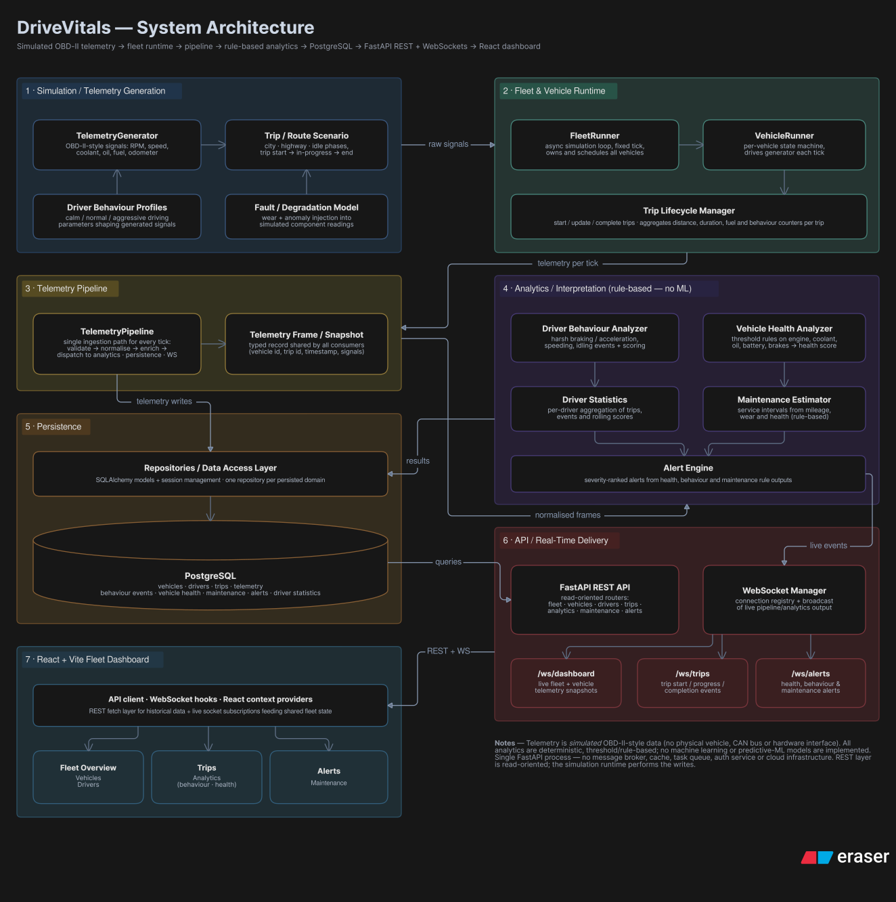

# DriveVitals

**A fleet intelligence and Digital Twin platform that simulates vehicle fleets, generates structured telemetry, processes it through analytics engines, and delivers real-time fleet intelligence through a React dashboard.**

[](https://github.com/harisrana-dev/DriveVitals/actions/workflows/ci.yml)
[]()
[]()
[]()
[]()
[]()

---

## Overview

DriveVitals is a fleet intelligence and Digital Twin platform. It simulates a fleet of vehicles, generates OBD-II-style telemetry for each one, processes that telemetry through analytics engines, persists operational data to PostgreSQL, and exposes fleet intelligence through REST APIs and WebSockets to a React dashboard.

The system separates **telemetry generation** from **interpretation**. The fleet runtime produces only raw measurements — speed, RPM, engine load, coolant temperature, brake pressure, fuel rate. All interpretation (driver behaviour detection, vehicle health scoring, maintenance estimation, alerting) happens downstream in dedicated analytics modules. This boundary means a real OBD-II/CAN hardware source could replace the simulator without modifying any downstream component.

Current analytics are **rule-based**; machine learning is not part of the current implementation.

---

## System Architecture



The architecture follows a layered pipeline:

**Fleet Runtime** → **Telemetry Pipeline** → **Analytics Engines** → **Persistence** → **REST / WebSockets** → **React Dashboard**

- The **fleet runtime** advances multiple simulated vehicles independently, each with its own driver behaviour profile and route assignment.
- A **fan-out telemetry pipeline** dispatches every sample to registered consumers (analytics, vehicle health, persistence) with no coupling between them.
- **Analytics engines** transform raw telemetry into operational intelligence: driver behaviour scores, vehicle health assessments, maintenance recommendations, and alerts.
- **Persistence** writes incrementally to PostgreSQL — telemetry, health, behaviour events, driver statistics, maintenance records, and alerts are stored as they are produced.
- **REST APIs** provide read-only access to historical data. **WebSockets** push live fleet state to the dashboard.
- The **React dashboard** renders fleet monitoring, vehicle health, driver intelligence, trip analytics, maintenance, and alerts.

---

## Digital Twin & Fleet Runtime

DriveVitals implements a physics-inspired vehicle simulation rather than a full physics engine. Each vehicle in the fleet is managed by a `VehicleRunner` that evolves its state tick-by-tick:

- **Vehicle state**: speed, RPM, throttle position, engine load, coolant temperature, fuel level, odometer, brake pressure
- **Driver behaviour profiles**: configurable thresholds for speeding, harsh braking, aggressive throttle, and high-RPM driving
- **Route context**: posted speed limits, route distance, which influence context-aware event detection
- **Trip lifecycle**: creation → start → live telemetry generation → completion → persistence of final metrics

The `FleetRunner` orchestrates all active vehicle assignments, advancing each one by a single tick and collecting the resulting `TelemetrySample` for downstream processing. State evolution is deterministic given the same driver profile, route, and initial conditions, making simulation runs reproducible.

---

## Telemetry Pipeline

The telemetry layer generates OBD-II-inspired measurements through a dedicated generator. Each tick produces a `TelemetrySample` containing:

| Signal | Description |
|---|---|
| Speed | Vehicle speed (km/h) |
| RPM | Engine revolutions per minute |
| Throttle position | Accelerator pedal position (%) |
| Brake pressure | Brake pedal pressure (0–1) |
| Engine load | Current engine load (%) |
| Coolant temperature | Engine coolant temperature (°C) |
| Fuel rate | Fuel consumption rate |
| Fuel level | Remaining fuel (%) |
| Odometer | Cumulative distance |

The `TelemetryPipeline` is a plain fan-out dispatcher: every registered consumer receives every sample independently. This decoupling means analytics, vehicle health, and persistence can be added or removed without affecting each other.

---

## Analytics & Fleet Intelligence

Analytics transform raw telemetry into operational intelligence. All analytics are **rule-based and deterministic** — every score and flag can be traced back to a named threshold.

### Driver Behaviour

`DriverBehaviourAnalyzer` evaluates each telemetry sample against configurable thresholds and route context, detecting:

- **Speeding** — speed exceeding the route's posted limit
- **Harsh braking** — brake pressure above threshold
- **Aggressive throttle** — throttle position above threshold
- **High-RPM driving** — engine RPM above threshold

Events are tracked over the trip lifetime, aggregated into counts, and converted to a 0–100 safety score using a deduction model.

### Vehicle Health

Five independent subsystem analyzers (engine, brake, cooling, transmission, fuel system) each produce a health score and status from a rolling telemetry window. Results are combined into a `HealthSnapshot` per vehicle per tick.

### Maintenance Estimation

Five maintenance estimators mirror the health subsystems, consuming health snapshots to produce prioritized `MaintenanceRecommendation` objects. Recommendations are surfaced through the REST API and alert system.

### Driver Statistics

`DriverStatisticsEngine` aggregates completed-trip behaviour summaries into standing per-driver statistics, updated once per trip completion rather than per tick.

### Alerting

Four alert generators (health, telemetry, maintenance, trip) produce `FleetAlert` records with deduplication. Alerts flow through a dedicated WebSocket channel for real-time notification.

---

## Data & Persistence

All operational data is persisted to **PostgreSQL 16** through an async repository layer built on **SQLAlchemy** (asyncpg driver) with **Alembic** migrations.

Persisted entities include:

| Entity | Description |
|---|---|
| Vehicles | Fleet vehicle definitions and metadata |
| Drivers | Driver profiles and assignments |
| Routes | Route definitions with speed limits and distances |
| Trips | Trip lifecycle records with start/completion timestamps |
| Telemetry | Per-tick OBD-II-style measurements |
| Behaviour Events | Detected speeding, braking, throttle, RPM events |
| Vehicle Health | Subsystem health snapshots |
| Driver Statistics | Aggregated per-driver performance metrics |
| Maintenance | Maintenance recommendations and status |
| Alerts | Fleet alerts with lifecycle tracking |

Data is written incrementally as it is produced — telemetry and health snapshots persist per tick, while behaviour events, driver statistics, maintenance records, and alerts persist at trip completion.

---

## Real-Time Communication

Three WebSocket channels provide live fleet intelligence:

| Endpoint | Channel | Purpose |
|---|---|---|
| `/ws/dashboard` | Fleet snapshots | Vehicle grid state, live telemetry summaries |
| `/ws/trips` | Trip snapshots | Active and recent trip status |
| `/ws/alerts` | Alert events | New, acknowledged, and resolved alerts |

Each channel follows the same pattern: an internal publisher feeds an `asyncio.Queue`, a background worker drains the queue, and a `WebSocketManager` broadcasts to all connected clients.

REST APIs (`/api/v1/`) provide read-only access to historical and per-entity data across 11 routers: vehicles, drivers, routes, trips, telemetry, analytics, vehicle health, driver statistics, maintenance, alerts, and system status.

---

## Frontend

The frontend is a **React 18 + Vite** single-page application with client-side routing (`react-router-dom`), data visualization (`recharts`), and icons (`lucide-react`). State management uses React Context and hooks — no external state library.

### Dashboard & Monitoring

- **Dashboard** — real-time fleet overview with live vehicle grid
- **Fleet** — vehicle list with health and fuel indicators
- **VehicleHealth** — subsystem health breakdown per vehicle
- **LiveTelemetry** — raw telemetry stream visualization

### Intelligence Views

- **Drivers** — driver profiles and behaviour metrics
- **Trips** — trip history and lifecycle tracking
- **Analytics** — fleet-wide analytics and trends
- **Maintenance** — maintenance recommendations and status
- **Alerts** — alert feed with acknowledgement and resolution

### Real-Time Integration

`LiveDataContext` subscribes to all three WebSocket channels and exposes live snapshots to the dashboard and trip views. The WebSocket client implements reconnect with exponential backoff and heartbeat-based stale connection detection.

---

## Testing & Validation

The test suite covers backend and frontend with layered test categories:

### Backend

**265 test functions** across three layers:

| Layer | Scope |
|---|---|
| Unit | Analytics context, engine, runtime state store, safety scoring |
| Integration | Fleet runtime end-to-end, intelligence consumers, persistence |
| API | REST endpoint validation, WebSocket connection lifecycle |

### Frontend

**140 test cases** across **10 test files** covering:

- Utility functions (alerts, dashboard, driver insights, benchmarks, maintenance)
- Service adapters (alert adapter, driver adapter, analytics API)
- Component behaviour

### CI Pipeline

Automated quality gates run on push and PR to `develop`:

- **Backend**: PostgreSQL service container, Alembic migrations, `pytest -v`
- **Frontend**: `npm ci`, `npm test`, `npm run lint`

---

## Technology Stack

| Layer | Technologies |
|---|---|
| **Backend** | Python 3.12+, FastAPI, Pydantic, SQLAlchemy (async), Alembic, asyncpg |
| **Database** | PostgreSQL 16 |
| **Real-time** | WebSockets (FastAPI native) |
| **Frontend** | React 18, Vite, React Router, Recharts, Lucide React |
| **Infrastructure** | Docker (PostgreSQL for local development) |
| **Testing** | pytest, pytest-asyncio, httpx (backend); Vitest, ESLint (frontend) |
| **Version Control** | Git, GitHub Actions CI |

---

## Current Scope & Limitations

DriveVitals is a feature-frozen engineering project in its current scope. The following are deliberate boundaries:

- **Telemetry is simulated** — no physical OBD-II/CAN hardware integration. The simulator produces OBD-II-shaped data specifically so a real source could replace it later.
- **Analytics are rule-based** — every score and flag is deterministic and threshold-driven. No machine learning is implemented.
- **No authentication** — the login/signup pages are static UI with no backend auth router, session handling, or user model.
- **No cloud deployment** — the application runs locally. Docker provisions PostgreSQL only; containerized app deployment is not implemented.
- **No message broker, cache, or task queue** — no Redis, Kafka, Celery, or similar infrastructure.
- **Frontend-backend REST integration is partial** — the dashboard vehicle grid consumes live WebSocket data, but some REST-backed views still use mock data as a fallback.
- **No coverage reporting** — the test suite runs but does not enforce minimum coverage thresholds.

---

## Future Direction

The following are planned extensions, not current capabilities:

- **Physical OBD-II/CAN ingestion** — replacing the simulator with real vehicle telemetry
- **Machine-learning driver behaviour modelling** — learned classifiers augmenting the rule-based baseline
- **Anomaly detection** — over rolling telemetry windows for early fault identification
- **Predictive maintenance** — replacing rule-based estimators with trained models
- **Full frontend-backend REST integration** — retiring mock data fallbacks
- **Authentication and multi-user access control**
- **Containerized application deployment**
- **Cloud deployment and multi-tenant operation**

---

## Project Status

Core product is **feature-frozen** and undergoing product polish, validation, and evidence preparation. The architecture, analytics pipeline, persistence layer, real-time communication, and React dashboard are implemented and tested. Documentation and presentation are being refined for professional and academic evaluation.

---

## Getting Started

### Database

```bash
docker compose up -d          # PostgreSQL 16 on localhost:5432
```

### Backend

```bash
python3 -m venv venv
source venv/bin/activate      # Windows: venv\Scripts\activate

pip install -r requirements.txt
alembic upgrade head

uvicorn backend.api.main:app --reload
```

API: `http://localhost:8000` · REST: `http://localhost:8000/api/v1/`

### Frontend

```bash
cd frontend
npm install
npm run dev
```

Dashboard: `http://localhost:5173`

### Tests

```bash
pytest                       # Backend: 265 tests
cd frontend && npm test      # Frontend: 140 tests
```

---

## License

[MIT License](./LICENSE) — Haris Kamal Rana
