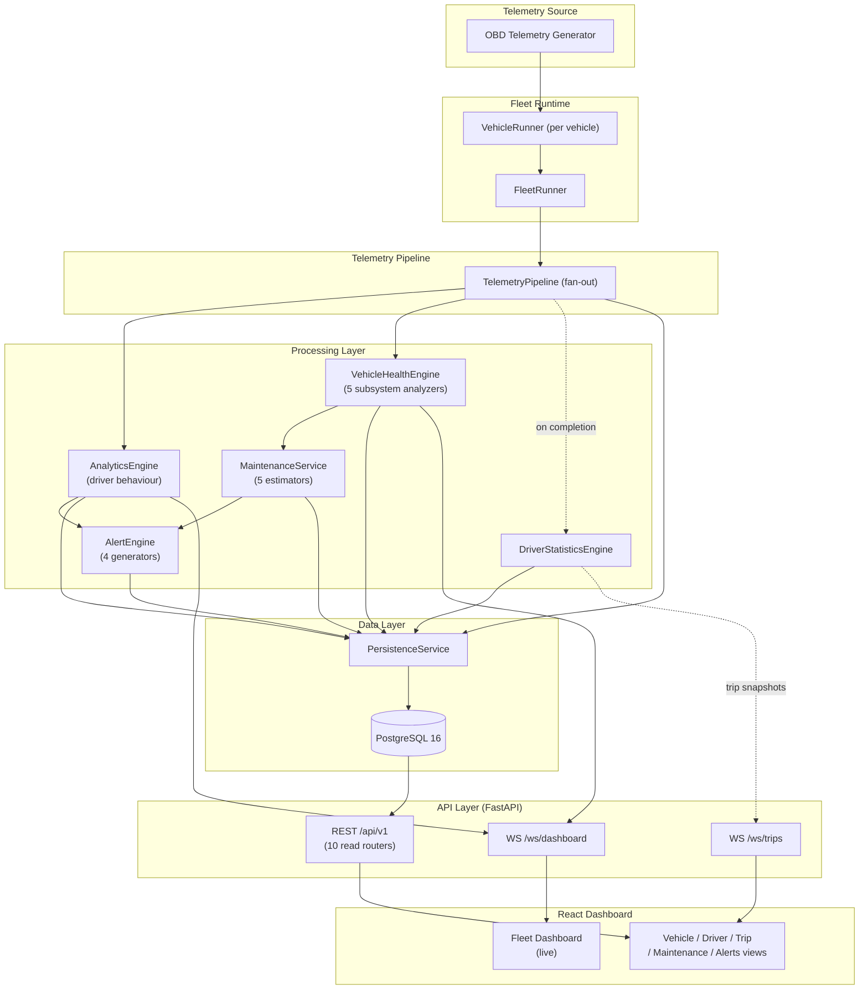
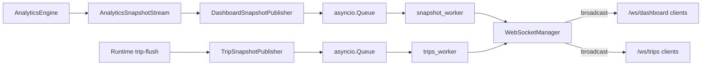

# DriveVitals

**A vehicle telemetry and fleet-intelligence platform: from simulated OBD-II signals to driver behaviour scoring, vehicle health monitoring, maintenance estimation, and a real-time fleet dashboard.**

[]()
[]()
[]()
[]()
[]()

DriveVitals generates physics-informed OBD-II-style telemetry for a simulated fleet, runs that telemetry through a layered analytics pipeline (driver behaviour, vehicle subsystem health, maintenance estimation, alerting), persists the results to PostgreSQL, and streams live fleet state to a React dashboard over WebSockets. It does not use real vehicle hardware or machine learning today — both are explicit, clearly separated roadmap items (see [§16 Roadmap](#16-roadmap) and [§19 Future ML Direction](#19-future-ml-direction)).

---

## Table of Contents

1. [Why DriveVitals Exists](#2-why-drivevitals-exists)
2. [Core Capabilities](#3-core-capabilities)
3. [Architecture](#4-architecture)
4. [Detailed Data Flow](#5-detailed-data-flow)
5. [Backend Architecture](#6-backend-architecture)
6. [Analytics / Driver Intelligence](#7-analytics--driver-intelligence)
7. [Trip Intelligence](#8-trip-intelligence)
8. [Real-Time Architecture](#9-real-time-architecture)
9. [Persistence / Database Architecture](#10-persistence--database-architecture)
10. [Frontend Architecture](#11-frontend-architecture)
11. [Engineering Decisions](#12-engineering-decisions)
12. [Testing](#13-testing)
13. [Running Locally](#14-running-locally)
14. [Project Structure](#15-project-structure)
15. [Roadmap](#16-roadmap)
16. [Academic / Research Relevance](#17-academic--research-relevance)
17. [Skills Demonstrated](#18-skills-demonstrated)
18. [Future ML Direction](#19-future-ml-direction)
19. [License / Author](#20-license--author)

---

## 2. Why DriveVitals Exists

A raw OBD-II or CAN stream is just numbers — speed, RPM, throttle position, coolant temperature, brake pressure. Turning that stream into something a fleet operator can act on requires several distinct transformations: telemetry has to be attributed to a vehicle, driver, and trip; interpreted against thresholds and context (e.g. a route's speed limit); aggregated over time into events and scores; evaluated for subsystem-level health; translated into maintenance recommendations; and finally surfaced live, without the operator having to poll or refresh.

DriveVitals is built around that pipeline — **telemetry → runtime state → analytics → health/maintenance intelligence → alerts → persistence → real-time delivery** — rather than around a single dashboard view. The project deliberately keeps the telemetry-generating layer free of interpretation: the fleet runtime only ever emits OBD-like measurements, never conclusions such as "driver is aggressive." All interpretation happens downstream, in dedicated analytics, health, and maintenance modules. This split is what makes it plausible to swap the simulator for a real telemetry source later without touching the intelligence layer.

Capabilities the codebase actually implements today:

- Real-time, per-vehicle telemetry generation and streaming
- Rule-based driver behaviour detection and scoring
- Subsystem-level vehicle health scoring (engine, brakes, cooling, transmission, fuel system)
- Deterministic maintenance recommendation estimation
- Trip lifecycle tracking (start → live telemetry → completion → persisted summary)
- A four-generator alerting system (health, telemetry, maintenance, trip alerts)
- PostgreSQL persistence via SQLAlchemy (async) and Alembic migrations
- A read-oriented REST API (10 routers, all `GET`) plus two WebSocket channels
- A React fleet dashboard, partially wired to live data (see [§11](#11-frontend-architecture))

---

## 3. Core Capabilities

| Capability | What DriveVitals Does | Implementation |
|---|---|---|
| Telemetry generation | Emits per-tick OBD-II-style samples (speed, RPM, throttle, brake pressure, coolant temp, engine load, fuel rate/level, odometer) for each simulated vehicle | `backend/telemetry/generators/obd_generator.py`, `backend/fleet/runtime/vehicle_runner.py` |
| Fleet runtime orchestration | Advances multiple independent vehicle/driver/route assignments tick-by-tick and forwards each `TelemetrySample` to a pluggable sink | `backend/fleet/runtime/fleet_runner.py` |
| Telemetry pipeline | Fan-out dispatch of each sample to every registered consumer (analytics, vehicle health, persistence) | `backend/pipeline/telemetry_pipeline.py` |
| Driver behaviour detection | Flags speeding, harsh braking, aggressive throttle, and high-RPM events against configurable thresholds and per-trip route context | `backend/analytics/behaviour/detection/analyzer.py` |
| Behaviour aggregation & scoring | Tracks behavioural events over a trip, summarizes them, and derives a 0–100 safety score | `backend/analytics/behaviour/events/tracker.py`, `.../aggregation/summarizer.py`, `backend/application/runtime.py` |
| Vehicle health scoring | Five independent subsystem analyzers (engine, brake, cooling, transmission, fuel system) produce a combined `HealthSnapshot` per telemetry sample | `backend/analytics/vehicle_health/` |
| Maintenance estimation | Five estimators mirror the health subsystems and turn health snapshots into prioritized maintenance recommendations and records | `backend/maintenance/estimators/`, `backend/maintenance/maintenance_service.py` |
| Driver statistics | Aggregates completed trips into longer-term per-driver statistics and scores | `backend/analytics/driver_statistics/` |
| Alerting | Four alert generators (health, telemetry, maintenance, trip) with deduplication | `backend/alerts/` |
| Persistence | Async repository layer over PostgreSQL for vehicles, drivers, routes, trips, telemetry, behaviour events, health, driver statistics, maintenance, alerts | `backend/db/` |
| REST API | 10 versioned, read-only routers under `/api/v1` | `backend/api/v1/routers/` |
| Real-time streaming | Two WebSocket channels broadcasting dashboard and trip snapshots | `backend/api/websocket/` |
| Fleet dashboard | React SPA consuming live WebSocket snapshots, with REST-backed drill-down views | `frontend/src/` |

---

## 4. Architecture



The diagram groups the system into six layers: a telemetry source, a fleet runtime that advances simulated vehicles independently, a fan-out pipeline, a processing layer of five cooperating engines, a PostgreSQL-backed persistence layer, and an API layer exposing both REST (historical/read) and WebSocket (live) access to a React dashboard.

Key points the diagram is making:

- The telemetry generator and fleet runtime produce **only measurements** — no interpretation happens before the telemetry pipeline.
- `TelemetryPipeline` is a plain fan-out dispatcher: every registered consumer (`AnalyticsEngine`, `VehicleHealthConsumer`, a persistence consumer) receives every sample independently.
- Vehicle health output feeds maintenance estimation, and both health and behaviour analytics feed the alert engine — alerting is a downstream consumer of intelligence, not a separate detection layer.
- Driver statistics are computed once per completed trip, not per tick, which is why that edge is dashed.
- Persistence is fed directly from each processing stage as data becomes available (telemetry, health, behaviour events, driver statistics, maintenance records, alerts), rather than as one bulk write at the end of a trip.
- The REST API only reads from PostgreSQL; nothing in the API layer writes back into the processing layer — mutation only happens through the runtime loop.
- Two independent WebSocket channels exist: `/ws/dashboard` (fleet-wide snapshots) and `/ws/trips` (trip snapshots), each with its own queue and broadcast worker.

---

## 5. Detailed Data Flow

```text
OBD telemetry generator
        ↓
VehicleRunner  (per-vehicle tick: physics + driver profile)
        ↓
FleetRunner.tick_all()  (advances every active vehicle for one tick)
        ↓
TelemetryPipeline.publish()  (fan-out to all registered consumers)
        ↓
   ┌────────────────────┬─────────────────────┐
   ↓                     ↓                     ↓
AnalyticsEngine   VehicleHealthConsumer   Persistence consumer
   ↓                     ↓                     ↓
Behaviour events   HealthSnapshot         telemetry_samples row
   ↓                     ↓
Trip-level         MaintenanceService
behaviour summary  (on health change)
   ↓                     ↓
AnalyticsSnapshot   MaintenanceRecommendation
   ↓                     ↓
AnalyticsSnapshotStream  AlertEngine → FleetAlert
   ↓
DashboardBuilder → DashboardSnapshot
   ↓
asyncio.Queue → snapshot_worker → WebSocketManager.broadcast()
   ↓
/ws/dashboard clients (React dashboard)
```

Each stage's responsibility:

- **VehicleRunner** advances one vehicle's physics-inspired state (speed, RPM, throttle, temperature, fuel) by one tick and emits an immutable `TelemetrySample`.
- **FleetRunner** ticks every active vehicle assignment and collects the resulting samples for one simulation step.
- **TelemetryPipeline** is a simple `register()`/`publish()` fan-out — it has no knowledge of what its consumers do with a sample.
- **AnalyticsEngine** combines the sample with per-vehicle runtime state and immutable trip context (route, speed limit, driver) to produce a point-in-time behaviour analysis, tracks behavioural events over the trip, and emits an `AnalyticsSnapshot`.
- **VehicleHealthConsumer / VehicleHealthEngine** runs five subsystem analyzers against a rolling telemetry window and the current `AnalyticsSnapshot` to produce a `HealthSnapshot`.
- **MaintenanceService** and **AlertEngine** are invoked from health/trip-completion events rather than every tick, since maintenance and alerts are lower-frequency conclusions than instantaneous telemetry.
- **DashboardBuilder** merges runtime state, health, and driver-statistics data into a `DashboardSnapshot`, which is queued and broadcast to every connected `/ws/dashboard` client. A parallel path builds `TripsSnapshot` objects for `/ws/trips`.

---

## 6. Backend Architecture

```text
backend/
├── telemetry/       # Telemetry sample model + OBD-style generator
├── fleet/            # Domain models (vehicle, driver, route, trip, assignment)
│                      # and runtime (FleetRunner, VehicleRunner, config/factory)
├── pipeline/         # TelemetryPipeline — fan-out dispatch to consumers
├── analytics/         # Driver behaviour detection/aggregation, vehicle health
│                      # engine, driver statistics, trip analysis, snapshots
├── maintenance/       # Subsystem maintenance estimators + MaintenanceService
├── alerts/            # Alert generators (health/telemetry/maintenance/trip),
│                      # deduplication, FleetAlert model
├── application/       # DriveVitalsRuntime — composition root and main loop;
│                      # intelligence-state consumers (health, driver stats)
├── streaming/         # AnalyticsSnapshotStream — pub/sub for snapshot subscribers
├── dashboard/         # DashboardBuilder — merges runtime state into a
│                      # frontend-ready DashboardSnapshot
├── trips/             # TripBuilder / TripStore — trip-level snapshot assembly
├── db/                # SQLAlchemy async models, repositories,
│                      # PersistenceService, Alembic migrations
├── api/               # FastAPI app, v1 REST routers/schemas/services,
│                      # WebSocket endpoints and managers
└── shared/, utils/    # Cross-cutting enums, exceptions, helpers
```

- **`fleet/`** owns the simulated world: vehicles, drivers, routes, and their assignments, plus the tick-driven runtime that advances them. It has no dependency on FastAPI or analytics.
- **`pipeline/`** is intentionally thin — a single fan-out class that decouples telemetry production from every downstream consumer.
- **`analytics/`** is the largest package and is itself layered: `behaviour/` (event detection, aggregation, scoring), `vehicle_health/` (subsystem analyzers), `driver_statistics/` (per-driver trend aggregation), `trip/` (trip-level summaries), `context/` and `state/` (immutable trip context vs. mutable runtime state), and `snapshot/` (the point-in-time output type consumed by streaming and persistence).
- **`maintenance/`** and **`alerts/`** are structurally parallel to `vehicle_health/` — each has one estimator/generator per subsystem, coordinated by a single service/engine class.
- **`application/runtime.py`** is the composition root (`DriveVitalsRuntime`): it wires every engine, registers pipeline consumers, drives the main tick loop, and owns trip-completion logic (persistence, driver statistics, maintenance, alerts) that doesn't fit cleanly into a single per-tick consumer.
- **`db/`** follows a repository pattern: one repository per aggregate (vehicle, driver, route, trip, telemetry, behaviour, vehicle health, driver statistics, maintenance, alert), all accessed through a single `PersistenceService` facade so the runtime never talks to SQLAlchemy directly.
- **`api/`** is a pure integration layer: FastAPI routers call into `api/v1/services/`, which read from the same repository layer used for persistence. No processing logic lives in the API layer.

---

## 7. Analytics / Driver Intelligence

DriveVitals' analytics are **deterministic and rule-based, not machine-learned**. This is an explicit, interpretable baseline: every score and flag can be traced back to a named threshold, which matters for a domain like fleet safety where operators need to understand *why* a driver was flagged. `DriverBehaviourAnalyzer` evaluates each telemetry sample against three configurable thresholds — harsh-braking pressure, aggressive-throttle position, and high-RPM — plus a context-aware speeding check derived from the route's posted speed limit, then assigns a severity tier from the combination of triggered conditions.

Individual detections are tracked over the lifetime of a trip by `BehaviourEventTracker` and rolled up by `DriverBehaviourSummarizer` into per-trip counts (speeding events, harsh-braking count, aggressive-throttle count, high-RPM count, severe/moderate event counts). `DriveVitalsRuntime` turns that summary into a 0–100 safety score with a simple deduction model (e.g. −5 per speeding event, −8 per severe event), clamped to `[0, 100]`.

Vehicle health uses the same architectural pattern in a separate domain: `VehicleHealthEngine` coordinates five independent `SubsystemHealthAnalyzer` implementations (engine, brake, cooling, transmission, fuel system), each producing its own `SubsystemHealth` score and status from a rolling telemetry window, combined into one `HealthSnapshot` per vehicle. Maintenance estimation mirrors this again: five `MaintenanceEstimator` subclasses consume the health snapshot, vehicle metadata, and current telemetry to produce prioritized `MaintenanceRecommendation` objects, which `MaintenanceService` never persists directly — that responsibility stays with `PersistenceService`, keeping estimation and persistence decoupled.

Driver statistics extend this to a longer time horizon: `DriverStatisticsEngine` and `DriverScoreCalculator` aggregate completed-trip behaviour summaries into standing per-driver statistics, updated once per trip completion rather than per tick.

---

## 8. Trip Intelligence

A trip's lifecycle runs through several coordinated components rather than a single "trip" object:

- **Creation** — when the fleet is configured, `DriveVitalsRuntime._configure_fleet()` builds one `Trip` per vehicle/driver/route assignment and registers an `AnalyticsContext` (route, speed limit, driver, vehicle metadata) that all downstream analyzers read from for the duration of the trip.
- **Start** — `FleetRunner.start_all()` marks every assignment's trip as started; if persistence is configured, trip rows are written to PostgreSQL *before* any telemetry is generated, since telemetry rows carry a foreign key to their trip.
- **Live telemetry** — each tick produces a `TelemetrySample` tied to the trip's `vehicle_id`/`driver_id`/`trip_id`, flowing through the pipeline described in [§5](#5-detailed-data-flow).
- **Completion** — when a `VehicleRunner` finishes its assigned route, the runtime flushes the vehicle's accumulated behaviour events (`AnalyticsEngine.flush_vehicle`), computes the final safety score, and derives trip-level metrics: distance (`Trip.distance_travelled_km`), duration (from trip start/completion timestamps), fuel used (from the vehicle's fuel-level delta against an assumed 60 L tank capacity), and average/maximum speed (average from distance/duration; maximum from the route's speed limit plus the summary's recorded maximum speed excess).
- **Persistence** — `PersistenceService.complete_trip()` writes the final trip row; a separate subscriber persists the trip's behaviour events from the last `AnalyticsSnapshot`.
- **Downstream effects** — trip completion also triggers driver-statistics aggregation, maintenance estimation (using the vehicle's final health snapshot and odometer), and trip-scoped alert generation, all fired from the same completion branch in `DriveVitalsRuntime.run()`.

The distinction worth noting for a technical reviewer: distance, duration, and speed are *derived* at completion time from accumulated runtime state, while behaviour counts and the safety score are *aggregated* incrementally throughout the trip.

---

## 9. Real-Time Architecture

DriveVitals exposes two independent, unauthenticated WebSocket endpoints, both implemented as: a queue fed by an internal publisher, a background `asyncio` worker that drains the queue, and a shared `WebSocketManager` that broadcasts to every connected client (no per-client filtering).

| Channel | Publisher | Payload | Consumed by |
|---|---|---|---|
| `/ws/dashboard` | `DashboardSnapshotPublisher`, subscribed to `AnalyticsSnapshotStream` | `{"type": "dashboard_snapshot", "data": {...}}` — fleet/vehicle summaries built by `DashboardBuilder` | `LiveDataContext` (dashboard vehicle grid) |
| `/ws/trips` | `TripSnapshotPublisher`, invoked from the runtime's trip-flush callback | `{"type": "trips_snapshot", "data": {...}}` — active/recent trip state built by `TripBuilder` | `LiveDataContext` (trips views) |

WebSockets are used here specifically because the dashboard needs continuous, low-latency updates as the simulation ticks — polling a REST endpoint every second for ten vehicles would be both wasteful and laggy. REST, by contrast, is reserved for **on-demand, historical, or per-entity reads** (a specific driver's statistics, a vehicle's maintenance history, a paginated alert list) where a client only needs data once, not continuously.



Both endpoints currently accept a connection and then only read (and discard) incoming text frames to detect disconnects — there is no client-to-server command protocol yet.

---

## 10. Persistence / Database Architecture

Persistence is **PostgreSQL 16**, accessed through SQLAlchemy's async engine (`asyncpg` driver) and versioned with Alembic (three migrations present: initial schema, route timestamps, driver-statistics scores). This is a correction from the project's original documentation, which described CSV-based storage — that was true at an earlier stage but the repository now implements a full async ORM + migration layer.

`PersistenceService` is the single entry point the runtime and API layer use for all database access; it wraps ten `Repository` classes (vehicle, driver, route, trip, telemetry, behaviour, vehicle health, driver statistics, maintenance, alert), each scoped to one aggregate and one `db/models/` SQLAlchemy model. Writes happen incrementally as data is produced — telemetry samples and health snapshots are persisted per tick, trip rows are created before telemetry begins (to satisfy a foreign-key constraint on `telemetry_samples`) and completed once the trip ends, and behaviour events, driver statistics, maintenance records, and alerts are persisted from their respective completion points rather than batched.

A `docker-compose.yml` at the repository root provisions a standalone Postgres 16 container (`drivevitals` database) for local development; connection parameters are read from environment variables (`POSTGRES_USER`, `POSTGRES_PASSWORD`, `POSTGRES_DB`, `POSTGRES_HOST`, `POSTGRES_PORT`) with local defaults. Containerized deployment of the application itself (as opposed to just its database) is not yet implemented.

---

## 11. Frontend Architecture

The frontend is a React 18 + Vite single-page application (`react-router-dom` for routing, `recharts` for charts, `lucide-react` for icons — no external state-management library; state is handled via React Context and hooks).

- **`context/`** — `LiveDataContext` subscribes to both WebSocket channels and exposes the latest `dashboard` and `trips` snapshots plus per-channel connection state; `FleetContext`, `TripsContext`, `TripDrawerContext`, and `VehicleDrawerContext` hold page-level and drawer UI state.
- **`websocket/`** — `connectionManager.js` implements reconnect-with-backoff-and-jitter, a heartbeat/stale-connection check, and a pub/sub `subscribeToChannel()` API used by `LiveDataContext`.
- **`api/`** — `apiClient.js` is a fetch wrapper with request timeouts and typed error classes (`ApiError`, `NetworkError`, `TimeoutError`, `PayloadError`); `endpoints.js` centralizes REST paths.
- **`hooks/`** — one hook per data domain (`useFleetData`, `useDrivers`, `useAlerts`, `useMaintenance`, `useVehicleHealth`, `useTripsData`, plus UI-utility hooks like `useSmoothValue` for animated numeric transitions).
- **`pages/`** — Dashboard, Fleet, VehicleHealth, Drivers, Trips, Maintenance, Alerts, Analytics, LiveTelemetry, Settings, plus static `login`/`signup` and a 404 page.
- **`components/`** — organized by domain (`dashboard/`, `fleet/`, `drivers/`, `trips/`, `maintenance/`, `alerts/`, `vehicleHealth/`) plus `common/`, `layout/`, `shared/`, and `ui/` primitives.

**Live vs. mock data (current state).** The dashboard's vehicle grid (`useFleetData`) merges live `/ws/dashboard` snapshot data through a mapping layer (`mapVehicles`) and falls back to a local mock dataset (`services/fleetService.js` → `mocks/data.js`) only until the first snapshot arrives. However, `fleetService.js` also remains the *primary* data source for drivers, alerts, maintenance items, and generic telemetry views (`getDrivers`, `getAlerts`, `getMaintenanceItems`, `getTelemetryData`) — these are not yet wired to the real `/api/v1/...` REST endpoints or to live snapshot data, despite the backend fully implementing those endpoints. `endpoints.js` also defines REST paths (e.g. `/vehicles/{id}/health`, `/summary`) that do not match the backend's actual routes (e.g. `/api/v1/vehicle-health/{vehicle_id}`, `/api/v1/driver-statistics/{driver_id}`) — the REST integration layer exists but is not yet fully connected end-to-end. This is flagged explicitly in [§16 Roadmap](#16-roadmap) rather than glossed over.

The `login`/`signup` pages are static UI only — there is no authentication router, session handling, or user model anywhere in the backend.

---

## 12. Engineering Decisions

- **Telemetry generation is kept free of interpretation.** `TelemetrySample` and the fleet runtime never produce analytical conclusions — that boundary is enforced structurally by putting behaviour/health/maintenance logic in entirely separate packages that only *consume* telemetry.
- **A fan-out pipeline decouples telemetry production from every consumer.** `TelemetryPipeline.register()` lets analytics, vehicle health, and persistence subscribe independently; none of them know about each other.
- **Five parallel subsystem analyzers/estimators, not one monolithic health function.** Vehicle health and maintenance both use one analyzer/estimator per subsystem (engine, brake, cooling, transmission, fuel system), coordinated by a thin engine/service class — the same structural pattern repeated across two domains.
- **REST for reads, WebSockets for continuous state.** All ten `/api/v1` routers are `GET`-only; live, high-frequency fleet state is pushed over WebSockets instead of polled.
- **Repository pattern over a single `PersistenceService` facade.** Neither the runtime nor the API layer talks to SQLAlchemy directly — every write and read goes through a repository scoped to one aggregate.
- **A simulator instead of requiring real OBD-II hardware.** `VehicleRunner`/`obd_generator.py` produce a schema shaped like a real OBD-II telemetry source specifically so a real integration could later replace the generator without changing anything downstream of `TelemetryPipeline`.
- **Immutable trip context vs. mutable runtime state, kept in separate stores.** `AnalyticsContext`/`AnalyticsContextStore` (route, speed limit, driver — fixed for a trip) are modeled separately from `RuntimeStateStore` (current speed, RPM, etc. — changes every tick), so analyzers can reason about "what's happening" vs. "what conditions apply" independently.
- **Trip rows are persisted before telemetry begins.** A deliberate ordering constraint (noted directly in `runtime.py`) to satisfy the `telemetry_samples_trip_id_fkey` foreign key.

---

## 13. Testing

The suite has **134 test functions** across three layers:

```text
tests/
├── unit/          # 46 tests — analytics context, analytics engine, runtime state store
├── integration/   # 24 tests — fleet runtime end-to-end, intelligence consumers,
│                    intelligence persistence
└── api/           # 64 tests — one file per router (vehicles, drivers, routes, trips,
                     telemetry, vehicle-health, driver-statistics, maintenance,
                     alerts, system) plus WebSocket connection tests
```

Run with:

```bash
pytest
```

(configured via `pytest.ini`: `asyncio_mode = auto`, `testpaths = tests`, using `pytest-asyncio` and `httpx` for async FastAPI test clients.)

**Known limitations:** there is no coverage reporting configured, no CI workflow in the repository, and the API tests exercise routers against a live/test database session rather than a fully isolated fixture per test — worth hardening before treating the suite as a regression safety net for a production system.

---

## 14. Running Locally

### Database

```bash
docker compose up -d          # starts PostgreSQL 16 on localhost:5432
```

### Backend

```bash
git clone https://github.com/harisrana-dev/DriveVitals
cd DriveVitals

python3 -m venv venv
source venv/bin/activate      # Windows: venv\Scripts\activate

pip install -r requirements.txt
alembic upgrade head           # apply database migrations

uvicorn backend.api.main:app --reload
```

The API is served at `http://localhost:8000` (`GET /` returns a status payload); REST routes are under `http://localhost:8000/api/v1/`, and WebSocket endpoints are at `ws://localhost:8000/ws/dashboard` and `ws://localhost:8000/ws/trips`.

### Frontend

```bash
cd frontend
cp .env.example .env           # optional — sensible defaults are built in
npm install
npm run dev
```

The dashboard is served at `http://localhost:5173`.

### Tests

```bash
pytest
```

### Environment variables

| Variable | Used by | Purpose |
|---|---|---|
| `POSTGRES_USER`, `POSTGRES_PASSWORD`, `POSTGRES_DB`, `POSTGRES_HOST`, `POSTGRES_PORT` | Backend (`backend/db/session.py`) | PostgreSQL connection (local defaults provided) |
| `PYTHONPATH` | Backend | Import resolution for `backend.*` modules |
| `VITE_API_BASE` | Frontend (`src/api/config.js`) | REST API base URL (defaults to `http://localhost:8000/api/v1`) |
| `VITE_WS_BASE` | Frontend | WebSocket base URL (defaults to `ws://localhost:8000`) |

---

## 15. Project Structure

```text
DriveVitals/
├── backend/
│   ├── telemetry/        # Telemetry model + generator
│   ├── fleet/             # Domain models + runtime (FleetRunner, VehicleRunner)
│   ├── pipeline/          # Telemetry fan-out
│   ├── analytics/         # Behaviour, vehicle health, driver statistics, trip analysis
│   ├── maintenance/       # Subsystem maintenance estimators
│   ├── alerts/            # Alert generators + deduplication
│   ├── application/       # Runtime composition root
│   ├── streaming/         # Snapshot pub/sub
│   ├── dashboard/         # Dashboard snapshot builder
│   ├── trips/             # Trip snapshot builder/store
│   ├── db/                # SQLAlchemy models, repositories, migrations
│   ├── api/                # FastAPI app, REST routers, WebSocket endpoints
│   └── tests/              # Ad-hoc WS test client
├── frontend/
│   └── src/
│       ├── context/, hooks/, services/, api/, websocket/
│       ├── pages/, components/
│       └── mocks/          # Fallback/placeholder data (see §11)
├── tests/                  # Full pytest suite (unit / integration / api)
├── scripts/                # Fleet demo runner, DB reset, WS test script
├── docs/                   # Design notes, architecture docs, team guides
├── research/               # Literature matrix and notes
├── docker-compose.yml       # PostgreSQL 16 for local development
└── requirements.txt
```

---

## 16. Roadmap

Everything below is **not implemented** and is not claimed elsewhere in this document:

- Real OBD-II / CAN bus integration, replacing the physics-inspired simulator
- Machine learning-based driver behaviour classification and anomaly detection (see [§19](#19-future-ml-direction))
- Predictive (rather than rule-based) maintenance modeling
- Full frontend/backend REST integration — retiring `mocks/data.js` fallbacks and aligning `frontend/src/api/endpoints.js` with the real `/api/v1` routes
- Authentication and multi-user access control (the current login/signup screens are static UI only)
- Containerized deployment of the application itself
- CI pipeline and test coverage reporting
- Larger-scale fleet simulation beyond the current six-vehicle/six-driver configuration
- Cloud deployment and multi-tenant operation

---

## 17. Academic / Research Relevance

DriveVitals is an engineering project, not a research artifact, but it demonstrates hands-on work with several concepts relevant to AI, automotive software, and data-engineering coursework:

- **Event-driven and streaming system design** — a fan-out telemetry pipeline, `asyncio.Queue`-based WebSocket broadcast workers, and a pub/sub snapshot stream
- **Real-time, low-latency data delivery** — WebSocket push architecture as an alternative to polling, including reconnect/backoff/heartbeat handling on the client
- **Time-series and per-tick state processing** — a rolling telemetry window feeding subsystem health analyzers
- **Interpretable rule-based decision systems** — threshold- and context-based behaviour detection and health scoring, explicitly built as a baseline that could later be replaced or augmented by learned models (§19)
- **Applied software architecture** — layered separation between telemetry generation, analytics, persistence, and transport; repository pattern; composition-root dependency wiring
- **Client-server and distributed communication patterns** — REST for on-demand reads, WebSockets for continuous push, and the trade-offs between them
- **Automotive domain modeling** — an OBD-II-shaped telemetry schema, subsystem-based vehicle health decomposition (engine/brake/cooling/transmission/fuel), and trip lifecycle modeling relevant to intelligent transportation systems and fleet telematics

The project's own `research/` directory (a literature matrix and topic notes) reflects background reading rather than implemented research output — it is included for transparency, not presented as a research contribution.

---

## 18. Skills Demonstrated

**Software Engineering**
Layered/domain-oriented architecture · composition-root dependency wiring · repository pattern · fan-out/pub-sub design · configuration-driven fleet setup

**Backend Engineering**
Python 3.12 · FastAPI · async/await · SQLAlchemy (async) · Alembic migrations · asyncpg · Pydantic-style schemas · WebSockets

**Data / Analytics**
Rule-based/deterministic scoring systems · time-windowed telemetry aggregation · trip-level and driver-level statistical aggregation

**Automotive / Telemetry**
OBD-II-style signal modeling · subsystem-based vehicle health decomposition · maintenance-estimation modeling · trip lifecycle tracking

**Frontend Engineering**
React 18 · Vite · React Router · React Context for state management · custom WebSocket client with reconnect/backoff · `recharts` data visualization

**Testing**
pytest, pytest-asyncio, httpx-based async API testing · unit / integration / API test layering (134 tests)

---

## 19. Future ML Direction

The current analytics stack is deterministic by design — every score traces back to a named, inspectable rule. That interpretable baseline is what a future machine-learning layer would sit on top of, not replace outright:

```text
Current (implemented):
Telemetry
  ↓
Threshold-based event detection (speeding, harsh braking, aggressive throttle, high RPM)
  ↓
Per-trip event aggregation
  ↓
Deterministic driver safety score

Future (not implemented):
Telemetry
  ↓
Feature extraction over rolling windows
  ↓
Learned model (e.g. sequence or tree-based classifier)
  ↓
Driver behaviour classification / anomaly scoring
  ↓
Risk prediction, fed alongside — not instead of — the existing rule-based score
```

Two directions the current architecture is already positioned for: (1) **anomaly detection** over the same per-vehicle rolling telemetry window the health analyzers already maintain, and (2) **predictive maintenance**, replacing the current rule-based estimators with models trained on health-snapshot history once enough simulated (or, eventually, real) trip data has accumulated. Neither is implemented; both are natural extensions of the existing `analytics/` and `maintenance/` package boundaries.

---

## 20. License / Author

Licensed under the [MIT License](./LICENSE).

**Author:** Haris Kamal Rana — designed and built independently as a personal project.