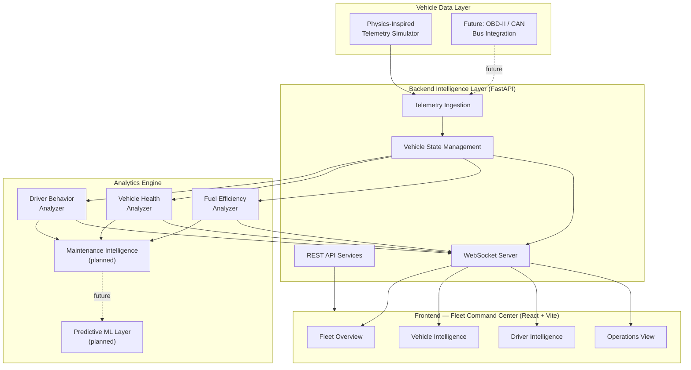

<div align="center">

# DriveVitals

### Vehicle Intelligence Platform

**Telemetry Analytics · Driver Behavior Insights · Predictive Vehicle Health**

*A vehicle intelligence and analytics platform currently under active development.*

[]()
[]()
[]()
[]()
[]()

</div>

---

## Table of Contents

1. [Overview](#1-overview)
2. [Problem Statement](#2-problem-statement)
3. [Solution Approach](#3-solution-approach)
4. [Key Features](#4-key-features)
5. [System Architecture](#5-system-architecture)
6. [Architecture Diagram](#6-architecture-diagram)
7. [Module Overview](#7-module-overview)
8. [Technology Stack](#8-technology-stack)
9. [Project Structure](#9-project-structure)
10. [Installation](#10-installation)
11. [Usage](#11-usage)
12. [Screenshots](#12-screenshots)
13. [Development Roadmap](#13-development-roadmap)
14. [Future Improvements](#14-future-improvements)
15. [Contributors](#15-contributors)

---

## 1. Overview

**DriveVitals** is a vehicle intelligence platform that transforms raw automotive telemetry into meaningful operational insight. The objective is not simply to collect vehicle data, but to build an **interpretation layer between vehicles and the people who operate and manage them.**

Modern vehicles already produce continuous streams of signals through their ECUs and onboard sensors. DriveVitals is designed to sit on top of that data layer and answer the questions fleet operators actually care about: *Is this vehicle healthy? Is this driver operating safely and efficiently? What needs attention before it becomes a failure?*

The platform is built around five core capabilities:

- Ingesting and processing vehicle telemetry in real time
- Continuously monitoring vehicle health indicators
- Modeling and scoring driver behavior
- Detecting abnormal operating patterns
- Surfacing maintenance-relevant insights to fleet operators

DriveVitals targets the connected-vehicle, fleet-intelligence, and predictive-maintenance space — domains where automotive OEMs, Tier 1 suppliers, and fleet software vendors are actively investing.

---

## 2. Problem Statement

Vehicles generate large volumes of telemetry through ECUs and onboard sensors, but that raw signal data is rarely usable in its native form. Fleet operators are typically left to interpret disconnected numbers rather than actionable insight.

In practice, fleet managers commonly lack:

- **Real-time visibility** into the state of vehicles across the fleet
- **Driver performance insight** — who drives efficiently and safely, and who doesn't
- **Early-warning indicators** for developing mechanical problems
- **Data-driven maintenance decisions**, as opposed to fixed-interval servicing
- **A clear read on operational efficiency** across the fleet as a whole

DriveVitals is built to close that gap: converting continuous, low-level telemetry into structured, decision-ready intelligence.

---

## 3. Solution Approach

DriveVitals approaches this problem in three layers:

1. **Acquire** — capture vehicle telemetry (currently via a physics-inspired simulator, with real OBD-II/CAN integration planned) at a consistent, structured schema.
2. **Interpret** — run that telemetry through a modular analytics engine that scores driver behavior, vehicle health, and fuel efficiency, and flags abnormal patterns.
3. **Present** — surface the resulting intelligence through a real-time fleet command center, so operators can act on it rather than dig for it.

This separation keeps the platform's intelligence layer decoupled from its data source — meaning the analytics engine built against simulated telemetry today is designed to operate unchanged once real OBD-II/CAN data is introduced.

---

## 4. Key Features

| Category | Capability |
|---|---|
| **Telemetry Simulation** | Physics-inspired vehicle simulator generating realistic speed, RPM, load, and thermal behavior |
| **Real-Time Streaming** | WebSocket-based live telemetry delivery to connected dashboards |
| **Driver Behavior Scoring** | Detection of overspeeding, harsh acceleration/braking, and aggressive driving patterns |
| **Vehicle Health Scoring** | Continuous evaluation of engine parameters and thermal/performance indicators |
| **Fuel Efficiency Analytics** | Consumption-rate and efficiency (km/L) analysis tied to driving patterns |
| **Fleet Command Center UI** | Enterprise-style dashboard focused on operational decision-making, not raw signal dumps |
| **Modular Analytics Engine** | Independent analyzer modules that can evolve or be replaced without touching ingestion or transport |
| **Extensible Data Layer** | Designed to accept real OBD-II/CAN telemetry without re-architecting the intelligence layer |

---

## 5. System Architecture

DriveVitals is organized as a modular, layered system:

**Vehicle Data Layer**
Generates and/or acquires vehicle telemetry. Currently backed by a physics-inspired simulator; designed to be replaced or supplemented by real OBD-II devices and CAN bus data without changing the layers above it.

**Backend Intelligence Layer** (FastAPI)
Owns telemetry ingestion, vehicle state management, REST API services, and WebSocket-based real-time communication.

**Analytics Engine**
A modular framework of independent analyzers — Driver Behavior, Vehicle Health, Fuel Efficiency, with Maintenance Intelligence and a Predictive/ML layer planned — each consuming structured telemetry and producing scores and insights.

**Frontend Layer** (React + Vite)
An enterprise fleet command center that presents fleet-level, vehicle-level, and driver-level intelligence in a decision-oriented interface.

**Real-Time Communication**
WebSockets connect the backend and frontend so dashboards update continuously as new telemetry and analytics results arrive, without polling or manual refresh.

---

## 6. Architecture Diagram



---

## 7. Module Overview

### Vehicle Data Layer
Produces the telemetry stream DriveVitals operates on. A physics-inspired simulator models vehicle speed, RPM, engine load, coolant temperature, throttle behavior, driving phases, and aggressive-driving conditions — direct ECU/CAN access is restricted by manufacturer-specific protocols, so simulation is the current substitute while remaining schema-compatible with future real-device integration.

### Backend Intelligence Layer
Built on **FastAPI**. Responsible for telemetry ingestion, processing, vehicle state management, REST API exposure, and WebSocket-based real-time communication with connected clients.

### Analytics Engine
A modular set of analyzers, each independently responsible for a specific dimension of vehicle intelligence:

**1. Driver Behavior Analyzer**
Detects overspeeding, harsh acceleration, harsh braking, and aggressive driving patterns; produces a driver behavior score, driving insights, and risk indicators.

**2. Vehicle Health Analyzer**
Evaluates engine parameters, temperature, and performance indicators to detect abnormal conditions; produces a vehicle health score, health status, and flags potential issues.

**3. Fuel Efficiency Analyzer**
Analyzes speed, fuel consumption rate, and driving patterns; produces km/L efficiency metrics, a fuel performance rating, and optimization insights.

**4. Maintenance Intelligence Module** *(planned)*
Will analyze behavioral and health trends over time to identify maintenance requirements, component degradation patterns, and possible failures before they occur.

**5. Predictive Analytics / Machine Learning Layer** *(planned)*
Will introduce ML models for driver behavior classification, anomaly detection, predictive maintenance, and broader pattern recognition across the fleet.

### Frontend — Fleet Command Center
A React + Vite dashboard designed around business intelligence rather than raw engineering telemetry:

- **Fleet Overview** — total vehicles, active vehicles, fleet-wide health summary
- **Vehicle Intelligence** — per-vehicle health score, current status, telemetry overview
- **Driver Intelligence** — driver rankings, behavior analysis, safety scores
- **Operations** — maintenance queue, recent events, fleet-wide trends

Individual vehicle pages provide deeper, per-vehicle telemetry visualization beyond the fleet-level summary.

---

## 8. Technology Stack

**Backend**
- Python
- FastAPI
- WebSockets
- Pydantic

**Frontend**
- React
- Vite
- Modern component-based UI architecture

**Data**
- CSV-based storage *(current, development stage)*
- PostgreSQL *(planned)*

**Engineering Practices**
- Git / GitHub version control
- Modular, layered architecture
- REST API design
- Real-time bidirectional communication

**Planned**
- Machine learning integration (behavior classification, anomaly detection, predictive maintenance)
- Cloud deployment
- Real vehicle (OBD-II / CAN) integration

---

## 9. Project Structure

```
DriveVitals/
├── backend/
│   ├── digital_twin/            # Simulation & domain model core
│   │   ├── runtime/             # Simulation clock, scheduler, lifecycle
│   │   ├── managers/            # Fleet, vehicle, driver, trip, dispatch, maintenance, environment
│   │   ├── entities/            # Domain entities (Vehicle, Driver, Trip, Route, Cargo, Fleet...)
│   │   ├── config/              # Configuration layer (dataclasses, defaults, constants)
│   │   └── common/              # Shared enums and exceptions
│   ├── api/                     # FastAPI routes and WebSocket endpoints
│   ├── analytics/                # Driver behavior, vehicle health, fuel efficiency analyzers
│   └── requirements.txt
├── frontend/
│   ├── src/
│   │   ├── components/          # Dashboard, fleet, vehicle, driver UI components
│   │   ├── pages/                # Fleet Overview, Vehicle, Driver, Operations views
│   │   └── services/             # API / WebSocket client layer
│   ├── package.json
│   └── vite.config.js
├── docs/                         # Architecture notes, schema references
└── README.md
```

> Structure reflects the current modular design; exact paths may evolve as new sprints (Physics, Telemetry, Analytics integration) land.

---

## 10. Installation

### Prerequisites
- Python 3.12+
- Node.js 18+
- npm or yarn

### Backend Setup

```bash
git clone https://github.com/harisrana-dev/DriveVitals
cd DriveVitals/backend

python3 -m venv venv
source venv/bin/activate      # Windows: venv\Scripts\activate

pip install -r requirements.txt

uvicorn main:app --reload
```

The backend API will be available at `http://localhost:8000`.

### Frontend Setup

```bash
cd DriveVitals/frontend

npm install
npm run dev
```

The dashboard will be available at `http://localhost:5173`.

---

## 11. Usage

1. Start the backend service to launch the telemetry simulator and API/WebSocket server.
2. Start the frontend to load the Fleet Command Center dashboard.
3. The simulator begins generating telemetry for configured vehicles; the backend streams it live over WebSocket.
4. The Analytics Engine processes incoming telemetry and produces driver behavior, vehicle health, and fuel efficiency scores in real time.
5. View fleet-wide status on the **Fleet Overview** page, or drill into a specific vehicle or driver for detailed insight.

---

## 12. Screenshots

> Screenshots will be added as the frontend implementation matures.

| Fleet Overview | Vehicle Intelligence | Driver Intelligence |
|---|---|---|
| *placeholder* | *placeholder* | *placeholder* |

---

## 13. Development Roadmap

- [x] Physics-inspired vehicle telemetry simulator
- [x] Simulation runtime (clock, scheduler, lifecycle management)
- [x] Fleet/vehicle/driver/trip/dispatch/maintenance/environment managers
- [x] Configuration layer
- [x] Domain entity model (Vehicle, Driver, Trip, Route, Cargo, Fleet)
- [ ] FastAPI ingestion and WebSocket streaming layer
- [ ] Driver Behavior Analyzer
- [ ] Vehicle Health Analyzer
- [ ] Fuel Efficiency Analyzer
- [ ] React + Vite Fleet Command Center dashboard
- [ ] PostgreSQL persistence layer
- [ ] Maintenance Intelligence module
- [ ] Predictive ML layer (anomaly detection, behavior classification)
- [ ] Real OBD-II device integration
- [ ] Cloud deployment

---

## 14. Future Improvements

- **Real vehicle integration** via OBD-II devices and CAN bus data, replacing/augmenting the simulator without changing the analytics or presentation layers.
- **Machine learning models** for driver behavior classification, anomaly detection, and predictive maintenance, built on top of the existing analytics engine.
- **Historical trend analysis** for long-term fleet health and driver performance tracking.
- **Cloud-native deployment** for multi-fleet, multi-tenant operation.
- **Alerting and notification system** for critical vehicle health or safety events.

---

## 15. Contributors

| Name | Role |
|---|---|
| *Haris* | Founder / Lead Engineer |

Contributions, issues, and feature discussions are welcome — open an issue or submit a pull request.

---

<div align="center">

**DriveVitals** — a vehicle intelligence and analytics platform currently under active development.

</div>

