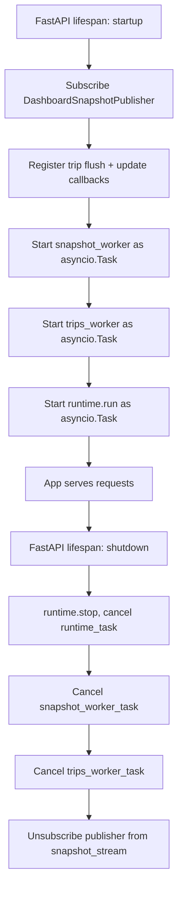

# API Design — DriveVitals Backend

> **Source of truth:** `backend/api/main.py`, `backend/api/v1/routers/`, `backend/api/websocket/`.
> This document describes the FastAPI integration layer as it exists today.

---

## 1. Application Composition

`backend/api/main.py` builds a module-level `DriveVitalsRuntime` instance and wires it into a FastAPI app via a `lifespan` context manager. The FastAPI layer does not contain analytics or telemetry logic — it only starts, connects, and stops pieces owned by the runtime and the WebSocket layer.



### Startup (`lifespan`)

On startup, `main.py`:

1. Subscribes `snapshot_publisher` to `runtime.snapshot_stream`.
2. Registers `_trip_flush` and `_trip_update` callbacks on the runtime.
3. Starts `snapshot_worker()` and `trips_worker()` as background `asyncio.Task`s.
4. Starts `runtime.run()` as a background `asyncio.Task`.

### Shutdown (`lifespan`)

On shutdown, in order:

1. `runtime.stop()` is called, then `runtime_task` is cancelled and awaited.
2. `snapshot_worker_task` and `trips_worker_task` are cancelled and awaited.
3. The publisher is unsubscribed from `runtime.snapshot_stream`.

This ordering matters: the runtime stops producing snapshots before workers and subscriptions are torn down.

---

## 2. REST API

The backend exposes **10 versioned routers** under `/api/v1`. All routers are `GET`-only except the alerts router, which also exposes `POST /acknowledge` and `POST /resolve`.

| Router | Prefix | Methods |
|--------|--------|---------|
| `vehicles` | `/api/v1/vehicles` | GET list, GET by id |
| `drivers` | `/api/v1/drivers` | GET list, GET by id |
| `routes` | `/api/v1/routes` | GET list, GET by id |
| `trips` | `/api/v1/trips` | GET list (paginated, filterable), GET by id |
| `telemetry` | `/api/v1/telemetry` | GET list, GET by vehicle |
| `vehicle-health` | `/api/v1/vehicle-health` | GET list, GET by vehicle |
| `driver-statistics` | `/api/v1/driver-statistics` | GET list, GET by driver |
| `maintenance` | `/api/v1/maintenance` | GET list, GET by vehicle |
| `alerts` | `/api/v1/alerts` | GET list, GET by vehicle, POST acknowledge, POST resolve |
| `system` | `/api/v1/system` | GET health, GET version, GET status |

### Root Endpoint

`GET /` returns a static status payload:

```json
{
  "name": "DriveVitals",
  "status": "running"
}
```

### Pagination

All list endpoints support `limit` (default `100`, max `500`) and `offset` (default `0`). Responses are wrapped in a standard envelope:

```json
{
  "data": [...],
  "count": 100
}
```

---

## 3. WebSocket Endpoints

Two WebSocket endpoints exist, both implemented as queue-fed broadcast workers:

### 3.1 `/ws/dashboard`

Defined in `backend/api/websocket/dashboard.py`. Broadcasts `dashboard_snapshot` messages produced by `DashboardSnapshotPublisher`.

**Connection lifecycle:**

1. Client opens a WebSocket connection to `/ws/dashboard`.
2. `websocket_manager.connect(websocket)` accepts the connection.
3. The route loops on `await websocket.receive_text()` to detect disconnects.
4. On `WebSocketDisconnect`, `websocket_manager.disconnect(websocket)` removes the connection.

**Data flow:**

```mermaid
graph LR
    A[AnalyticsEngine] -->|publishes| B[AnalyticsSnapshot]
    B --> C[AnalyticsSnapshotStream]
    C -->|subscribed| D[DashboardSnapshotPublisher]
    D -->|put_nowait| E[snapshot_queue]
    E -->|await get| F[snapshot_worker]
    F -->|broadcast| G[WebSocketManager]
    G -->|send_json| H[/ws/dashboard clients]
```

### 3.2 `/ws/trips`

Defined in `backend/api/websocket/trips.py`. Broadcasts `trips_snapshot` messages produced by `TripSnapshotPublisher`. Two sub-types are emitted:

1. **Active-trip updates** — once per tick, containing only currently active trips.
2. **Completion events** — when a trip finishes, the updated completed-trip set is broadcast.

**Data flow:**

```mermaid
graph LR
    A[Runtime trip-flush / active-tick] --> B[TripSnapshotPublisher]
    B -->|build + store| C[TripStore]
    B -->|put_nowait| D[trips_queue]
    D -->|await get| E[trips_worker]
    E -->|broadcast| F[WebSocketManager]
    F -->|send_json| G[/ws/trips clients]
```

### 3.3 Multiple Clients

`WebSocketManager` stores all active connections in a list and `broadcast()` iterates over all of them. Any number of clients can connect simultaneously and receive the same snapshot stream; there is no per-client filtering.

---

## 4. What a Frontend Developer Needs to Know

- REST base URL: `http://localhost:8000/api/v1`
- WebSocket URLs: `ws://localhost:8000/ws/dashboard` and `ws://localhost:8000/ws/trips`
- The backend pushes snapshots — there is no request/response or polling model for live data.
- The WebSocket connection is server-push only. The server reads incoming text frames only to detect disconnects; client-to-server commands have no effect.
- `/ws/dashboard` messages have `"type": "dashboard_snapshot"`.
- `/ws/trips` messages have `"type": "trips_snapshot"`.
- CORS allows `http://localhost:5173`.

---

## 5. Component Responsibilities

| Component | Responsibility |
|-----------|----------------|
| `main.py` (`lifespan`) | Composes runtime, publishers, workers, and callbacks; starts/stops them in order. |
| `dashboard_router` (`/ws/dashboard`) | Accepts/closes WebSocket connections; no business logic. |
| `trips_router` (`/ws/trips`) | Accepts/closes WebSocket connections; no business logic. |
| `snapshot_queue` / `trips_queue` | `asyncio.Queue` — hand-off between sync publishers and async workers. |
| `snapshot_worker` / `trips_worker` | Consume queues, serialize payloads, broadcast. |
| `DashboardSnapshotPublisher` | Subscriber to `AnalyticsSnapshotStream`; bridges sync stream to async queue. |
| `TripSnapshotPublisher` | Builds trip snapshots from runtime callbacks; bridges to async queue. |
| `WebSocketManager` | Owns active connections; connect, disconnect, broadcast. |

---

## 6. Error Behavior

- **404** — entity not found.
- **400** — validation failure (e.g. `limit` outside `1..500`).
- **500** — unhandled server error; also returned by `/system/health` when the database is unreachable.

All errors follow the standard FastAPI JSON shape: `{"detail": "..."}`.
