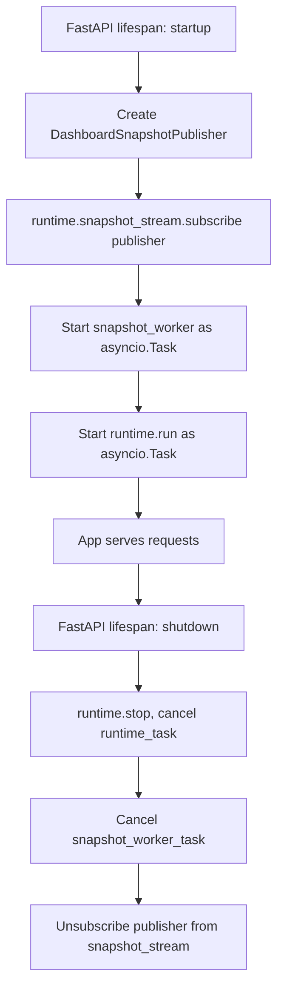

# API Design — DriveVitals Backend

This document describes the current FastAPI integration layer: how the app is composed, what it exposes, and how analytics data reaches connected dashboard clients.

There are no REST endpoints for telemetry or analytics data. The only HTTP surface is a root status endpoint. All live data delivery happens over a single WebSocket connection.

## Application Composition

`backend/api/main.py` builds a module-level `DriveVitalsRuntime` instance and wires it into a FastAPI app via a `lifespan` context manager. The FastAPI layer does not contain any analytics or telemetry logic itself — it only starts, connects, and stops pieces owned by the runtime and the WebSocket layer.



### Startup (`lifespan`)

On startup, `main.py`:

1. Creates a `DashboardSnapshotPublisher` bound to the module-level `snapshot_queue`.
2. Subscribes that publisher to `runtime.snapshot_stream` (the `AnalyticsSnapshotStream` owned by the runtime).
3. Starts `snapshot_worker()` as an `asyncio.Task`.
4. Starts `runtime.run()` as an `asyncio.Task`.

### Shutdown (`lifespan`)

On shutdown, in order:

1. `runtime.stop()` is called, then `runtime_task` is cancelled and awaited (swallowing `asyncio.CancelledError`).
2. `snapshot_worker_task` is cancelled and awaited the same way.
3. The publisher is unsubscribed from `runtime.snapshot_stream`.

This ordering matters: the runtime stops producing snapshots before the worker and subscription are torn down.

## Root Endpoint

`GET /` returns a static status payload:

```json
{
  "name": "DriveVitals",
  "status": "running"
}
```

This is the only HTTP endpoint currently exposed. There are no REST endpoints for vehicles, drivers, trips, telemetry, or analytics.

## `/ws/dashboard` Endpoint

Defined in `backend/api/websocket/dashboard.py`, registered on the app via `dashboard_router`.

### Connection lifecycle

1. Client opens a WebSocket connection to `/ws/dashboard`.
2. `websocket_manager.connect(websocket)` accepts the connection and adds it to the manager's active connection list.
3. The route enters a loop calling `await websocket.receive_text()`. This keeps the connection open and detects disconnects; the backend does not currently act on any text a client sends.
4. On `WebSocketDisconnect`, `websocket_manager.disconnect(websocket)` removes the connection.

The route contains no business logic — it only manages the connection lifecycle by delegating to `websocket_manager`.

## Snapshot-to-Client Data Flow

Analytics processing (inside `DriveVitalsRuntime`) is synchronous and has no knowledge of WebSockets. Delivery to dashboard clients is asynchronous and lives entirely in the FastAPI/WebSocket layer. The boundary between the two is `AnalyticsSnapshotStream` plus `DashboardSnapshotPublisher`:

```mermaid
graph LR
    A[AnalyticsEngine] -->|produces| B[AnalyticsSnapshot]
    B --> C[AnalyticsSnapshotStream]
    C -->|subscribed| D[DashboardSnapshotPublisher]
    D -->|put_nowait| E[asyncio.Queue]
    E -->|await get| F[snapshot_worker]
    F -->|build_dashboard_payload| G[dict payload]
    G -->|broadcast| H[WebSocketManager]
    H --> I[Connected dashboard clients]
```



1. `AnalyticsEngine` emits an `AnalyticsSnapshot` onto `AnalyticsSnapshotStream` (synchronous, no async/await involved).
2. `DashboardSnapshotPublisher.publish()` is invoked as a subscriber and calls `queue.put_nowait(snapshot)` — this is the sync-to-async adaptation point.
3. `snapshot_worker()` loops on `await snapshot_queue.get()`, converts each snapshot to a JSON-serializable dict via `build_dashboard_payload()`, and calls `await websocket_manager.broadcast(payload)`.
4. `websocket_manager.broadcast()` sends the payload to every currently connected client via `send_json`, removing any connection that raises during send.

## Dashboard Payload Contract

`build_dashboard_payload()` produces:

```json
{
  "type": "analytics_snapshot",
  "vehicle_id": "...",
  "driver_id": "...",
  "trip_id": "...",
  "timestamp": "ISO-8601 string",
  "telemetry": {
    "speed_kmh": 0,
    "rpm": 0,
    "engine_load_percent": 0,
    "throttle_position_percent": 0,
    "brake_percent": 0,
    "coolant_temperature_c": 0,
    "fuel_rate_lph": 0,
    "fuel_level_percent": 0,
    "odometer_km": 0
  },
  "behaviour": {
    "speeding": false,
    "harsh_braking": false,
    "aggressive_throttle": false,
    "high_rpm": false,
    "speed_excess_kmh": 0,
    "severity": "..."
  },
  "events": {
    "completed": [
      {
        "event_type": "...",
        "started_at": "ISO-8601 string",
        "ended_at": "ISO-8601 string",
        "duration_seconds": 0,
        "distance_km": 0,
        "severity": "..."
      }
    ],
    "active": ["..."]
  }
}
```

This is currently the only message shape sent over `/ws/dashboard`.

## Component Responsibilities

| Component | Responsibility |
|---|---|
| `main.py` (`lifespan`) | Composes the runtime, publisher, worker task, and subscription; starts and stops them in the correct order. |
| `dashboard_router` (`/ws/dashboard`) | Accepts/closes WebSocket connections via `websocket_manager`; no business logic. |
| `snapshot_queue` | `asyncio.Queue[AnalyticsSnapshot]` — the hand-off point between sync analytics and async delivery. |
| `build_dashboard_payload` | Pure function converting an `AnalyticsSnapshot` into the JSON contract above. |
| `snapshot_worker` | Consumes the queue, builds payloads, broadcasts them. |
| `DashboardSnapshotPublisher` | Subscriber to `AnalyticsSnapshotStream`; bridges sync stream to async queue via `put_nowait`. |
| `WebSocketManager` | Owns the list of active connections; connect, disconnect, broadcast, `connection_count`. |

## Multiple Clients

`WebSocketManager` stores all active connections in a list and `broadcast()` iterates over all of them, sending the same payload to each. Any number of dashboard clients can be connected simultaneously and all receive the same snapshot stream; there is no per-client filtering.

## What a Frontend Developer Needs to Know

- Connect to `ws://localhost:8000/ws/dashboard`.
- The backend pushes `analytics_snapshot` messages as they are produced — there is no request/response or polling model.
- The connection is otherwise one-way from a data standpoint: the server loop only reads incoming text to detect disconnects; sending anything meaningful from the client currently has no effect on the backend.
- Every message currently has `"type": "analytics_snapshot"` and the shape documented above.