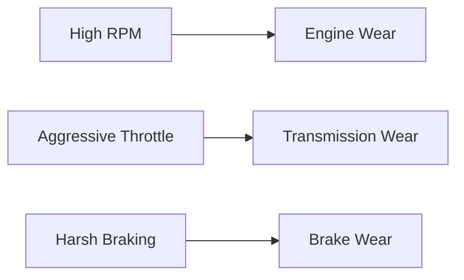
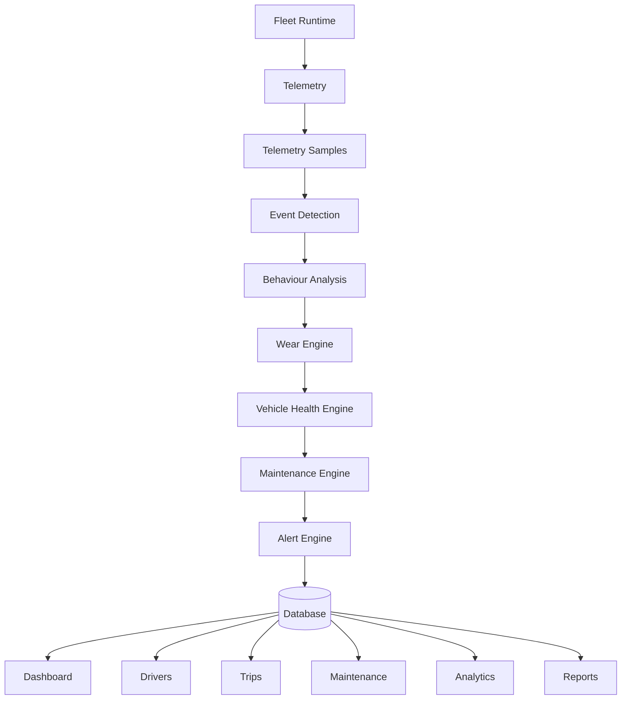

# DriveVitals Database Design

**Version:** 1.0
**Status:** Architecture Frozen

---

## Purpose

The DriveVitals database exists to transform live telemetry into persistent fleet intelligence.

The simulator produces telemetry in real time. The database preserves:

- Fleet history
- Driver behaviour
- Vehicle health
- Maintenance history
- Alerts
- Trips
- Analytics

> The dashboard should never be the source of truth.
> **The database is the source of truth.**

---

## Design Principles

### 1. Telemetry is immutable

Telemetry samples are never modified. Every OBD sample represents historical truth.

**Examples:**
- Speed
- RPM
- Engine Load
- Coolant
- Fuel
- Throttle
- Brake

These are stored exactly as received.

### 2. Events are observations

Events are generated from telemetry.

**Examples:**
- High RPM
- Harsh Braking
- Aggressive Throttle
- Speeding

Events are not conclusions — they simply describe what happened.

### 3. Behaviour is intelligence

Behaviour is calculated from many events. Events alone never determine driver quality.

| Driver Type | Harsh Brakes | Distance | Trip Score |
|---|---|---|---|
| Good driver | 3 | 420 km | Excellent |
| Poor driver | 30 | 40 km | Poor |

### 4. Wear accumulates

Vehicle components never instantly lose health. Every behaviour event contributes wear over time.



### 5. Health is calculated

Vehicle health is derived from accumulated wear. Health is never directly edited.

### 6. Maintenance is predicted

Maintenance is generated from **Vehicle Health**, not from raw Behaviour Events.

### 7. Alerts are actionable

Alerts should represent meaningful operational issues.

- Temporary events remain inside telemetry.
- Persistent operational issues become alerts.

---

## System Pipeline



---

## Domain Model

```
Fleet
├── Vehicles
│   ├── Trips
│   ├── Alerts
│   ├── Maintenance
│   ├── Health
│   └── Statistics
│
└── Drivers
    ├── Trips
    ├── Statistics
    └── Behaviour

Trips
├── Telemetry Samples
├── Behaviour Events
└── Summary
```

---

## Repository Layer

- `VehicleRepository`
- `DriverRepository`
- `TripRepository`
- `TelemetryRepository`
- `BehaviourRepository`
- `AlertRepository`
- `MaintenanceRepository`
- `VehicleHealthRepository`
- `DriverStatisticsRepository`
- `VehicleStatisticsRepository`
- `RouteRepository`

> Repositories own persistence. Business logic never writes SQL.

---

## Service Responsibilities

| Service | Responsibility |
|---|---|
| Fleet Runtime | Produces simulation data |
| Telemetry Service | Creates telemetry samples |
| Analytics Engine | Detects behaviour |
| Wear Engine | Calculates component wear |
| Vehicle Health Engine | Calculates overall health |
| Maintenance Engine | Generates maintenance tasks |
| Alert Engine | Creates operational alerts |
| Dashboard Builder | Produces read models |
| Database | Stores historical truth |

---

## Read Models

The following objects are **never persisted** — they are generated dynamically:

- `DashboardSnapshot`
- `FleetSnapshot`
- Dashboard Cards
- Dashboard Metrics

---

## Future Expansion

The architecture supports, without redesigning the database:

- Real OBD-II adapters
- Multiple fleets
- Cloud deployment
- Fleet managers
- Driver accounts
- Historical analytics
- Predictive maintenance
- Machine Learning
- Route optimization