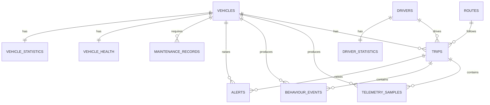
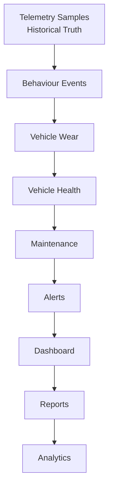

# DriveVitals Database Schema

**Version:** 1.0
**Status:** Frozen

---

## Entity Relationship Overview

---

## Tables

### vehicles

**Primary Key:** `vehicle_id`

| Column |
|---|
| vehicle_id |
| registration_number |
| vin |
| manufacturer |
| model |
| year |
| fuel_type |
| status |
| created_at |
| updated_at |

**Relationships:** 1 Vehicle → Many Trips, Many Alerts, Many Maintenance Records, Many Telemetry Samples, One Vehicle Health, One Vehicle Statistics

---

### drivers

**Primary Key:** `driver_id`

| Column |
|---|
| driver_id |
| first_name |
| last_name |
| license_number |
| employment_status |
| created_at |
| updated_at |

**Relationships:** 1 Driver → Many Trips, One Driver Statistics

---

### routes

**Primary Key:** `route_id`

| Column |
|---|
| route_id |
| name |
| route_type |
| origin |
| destination |
| estimated_distance_km |
| created_at |

**Relationships:** 1 Route → Many Trips

---

### trips

**Primary Key:** `trip_id`
**Foreign Keys:** `vehicle_id`, `driver_id`, `route_id`

| Column |
|---|
| trip_id |
| vehicle_id |
| driver_id |
| route_id |
| start_time |
| end_time |
| distance_km |
| duration_seconds |
| fuel_used_liters |
| average_speed_kmh |
| maximum_speed_kmh |
| trip_score |
| status |
| created_at |

**Relationships:** 1 Trip → Many Telemetry Samples, Many Behaviour Events, Many Alerts

---

### telemetry_samples

**Primary Key:** `sample_id`
**Foreign Keys:** `trip_id`, `vehicle_id`

| Column |
|---|
| sample_id |
| trip_id |
| vehicle_id |
| timestamp |
| speed_kmh |
| rpm |
| engine_load_percent |
| throttle_percent |
| brake_percent |
| fuel_rate_lph |
| fuel_level_percent |
| coolant_temperature_c |
| odometer_km |

**Relationships:** Many Samples → One Trip

---

### behaviour_events

**Primary Key:** `event_id`
**Foreign Keys:** `trip_id`, `vehicle_id`, `driver_id`

| Column |
|---|
| event_id |
| trip_id |
| vehicle_id |
| driver_id |
| event_type |
| severity |
| started_at |
| ended_at |
| duration_seconds |
| distance_km |
| maximum_value |
| average_value |

**Relationships:** Many Events → One Trip

---

### alerts

**Primary Key:** `alert_id`
**Foreign Keys:** `vehicle_id`, `driver_id`, `trip_id`

| Column |
|---|
| alert_id |
| vehicle_id |
| driver_id |
| trip_id |
| alert_type |
| severity |
| status |
| acknowledged |
| created_at |
| resolved_at |

**Relationships:** Many Alerts → One Vehicle

---

### maintenance_records

**Primary Key:** `maintenance_id`
**Foreign Keys:** `vehicle_id`

| Column |
|---|
| maintenance_id |
| vehicle_id |
| maintenance_type |
| priority |
| status |
| due_odometer_km |
| completed_odometer_km |
| created_at |
| completed_at |

**Relationships:** Many Records → One Vehicle

---

### vehicle_health

**Primary Key:** `vehicle_id`
**Foreign Keys:** `vehicle_id`

| Column |
|---|
| vehicle_id |
| overall_health_score |
| engine_health |
| brake_health |
| transmission_health |
| cooling_health |
| fuel_system_health |
| last_updated |

**Relationships:** One Vehicle → One Health Record

---

### driver_statistics

**Primary Key:** `driver_id`
**Foreign Keys:** `driver_id`

| Column |
|---|
| driver_id |
| total_trips |
| total_distance_km |
| total_driving_time_seconds |
| average_trip_score |
| fuel_efficiency |
| speeding_events |
| harsh_braking_events |
| aggressive_throttle_events |
| high_rpm_events |
| safety_score |
| last_updated |

**Relationships:** One Driver → One Statistics Record

---

### vehicle_statistics

**Primary Key:** `vehicle_id`
**Foreign Keys:** `vehicle_id`

| Column |
|---|
| vehicle_id |
| trip_count |
| total_distance_km |
| total_runtime_seconds |
| fuel_consumed_liters |
| average_fuel_efficiency |
| lifetime_health_score |
| utilization_percent |
| last_updated |

**Relationships:** One Vehicle → One Statistics Record

---

## Indexes

| Table | Indexed Columns |
|---|---|
| vehicles | registration_number, vin |
| drivers | license_number |
| trips | vehicle_id, driver_id, start_time |
| telemetry_samples | trip_id, timestamp, vehicle_id |
| behaviour_events | trip_id, vehicle_id |
| alerts | vehicle_id, status, severity |
| maintenance_records | vehicle_id, status |

---

## Cardinality

| Parent (1) | Child (Many / One) |
|---|---|
| Vehicle | Many Trips |
| Driver | Many Trips |
| Route | Many Trips |
| Trip | Many Telemetry Samples |
| Trip | Many Behaviour Events |
| Trip | Many Alerts |
| Vehicle | Many Alerts |
| Vehicle | Many Maintenance Records |
| Vehicle | One Vehicle Health |
| Vehicle | One Vehicle Statistics |
| Driver | One Driver Statistics |

---

## Source of Truth

