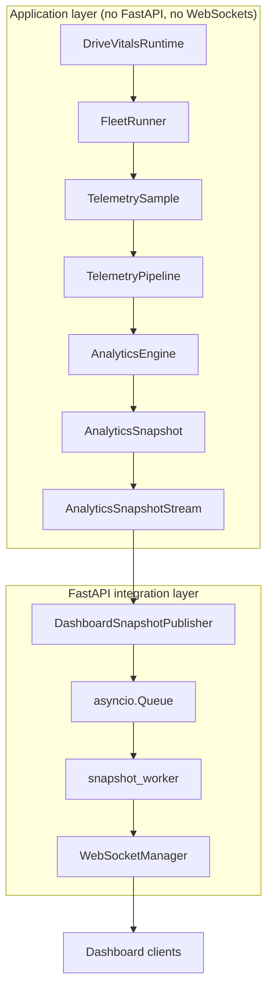

# Backend Guide — DriveVitals

This is a practical guide to the current backend implementation: what each part does and how data moves from the fleet runtime to connected dashboard clients.

## Architecture Diagram



## Folder Responsibilities

Based on the modules currently imported and implemented:

| Folder | Responsibility |
|---|---|
| `backend/api/` | FastAPI composition: `main.py` (app + lifespan), `dependencies.py` (shared `websocket_manager` instance), `websocket/` (the `/ws/dashboard` route, payload building, sync-to-async adaptation, connection management). This is the integration/composition layer. |
| `backend/application/` | `runtime.py` — `DriveVitalsRuntime`, which composes the fleet, telemetry pipeline, and analytics engine, and drives the runtime loop. Framework-independent. |
| `backend/fleet/` | Fleet domain: config/factory for loading fleet assignments (`FleetFactory`), models (`Trip`, plus vehicle/driver/route models referenced by the runtime), and `FleetRunner`, which produces telemetry samples for all active vehicles each tick. |
| `backend/pipeline/` | `TelemetryPipeline` — receives telemetry samples from the fleet and dispatches them to registered consumers (the analytics engine). |
| `backend/analytics/` | Analytics domain, split into: `behaviour/` (detection, event tracking, summarization of driver behaviour), `context/` (`AnalyticsContext` and its store, holding per-vehicle/driver/trip/route context), `state/` (`RuntimeStateStore`), `snapshot/` (`AnalyticsSnapshot` model and its store), and `engine.py` (`AnalyticsEngine`, which ties all of the above together to produce snapshots). |
| `backend/streaming/` | `AnalyticsSnapshotStream` — the sync publish/subscribe stream that `AnalyticsEngine` emits snapshots onto, and that the FastAPI layer subscribes to. |

## Application Startup

`backend/api/main.py` creates a single module-level `DriveVitalsRuntime()`. On FastAPI `lifespan` startup it:

1. Creates a `DashboardSnapshotPublisher(queue=snapshot_queue)`.
2. Subscribes it to `runtime.snapshot_stream`.
3. Starts `snapshot_worker()` as a background `asyncio.Task`.
4. Starts `runtime.run()` as a background `asyncio.Task`.

On shutdown, it stops the runtime, cancels the runtime task, cancels the snapshot worker task, and unsubscribes the publisher — in that order.

## DriveVitalsRuntime

`backend/application/runtime.py`. Composes and owns:

- `FleetRunner` (`_fleet`)
- `TelemetryPipeline` (`_telemetry_pipeline`)
- Analytics dependencies: `RuntimeStateStore`, `AnalyticsContextStore`, `DriverBehaviourAnalyzer`, `BehaviourEventTracker`, `DriverBehaviourSummarizer`, `AnalyticsSnapshotStore`
- `AnalyticsSnapshotStream` (`_snapshot_stream`)
- `AnalyticsEngine` (`_analytics_engine`), built from all of the above

At construction, it registers the analytics engine with the telemetry pipeline (`telemetry_pipeline.register(analytics_engine)`) and loads fleet configuration via `FleetFactory.from_config()`, building an `AnalyticsContext` per assignment and adding each vehicle/driver/route/trip combination to the fleet.

Its docstring is explicit that the runtime does not know about FastAPI, WebSockets, frontend clients, or HTTP routes.

`run()` drives the loop:

```python
self._fleet.start_all(now=start_time)
while self._running and self._fleet.active_runners():
    samples = self._fleet.tick_all(now=now)
    for sample in samples:
        self._telemetry_pipeline.publish(sample)
    now += timedelta(seconds=self._tick_seconds)
    await asyncio.sleep(self._tick_seconds)
```

`stop()` simply sets an internal flag that ends the loop on its next iteration.

## FleetRunner

Ticks all configured vehicle assignments each cycle and returns the `TelemetrySample`s produced (`tick_all`). `start_all` begins all runners; `active_runners()` reports whether any are still running, which gates the runtime loop.

## TelemetryPipeline

Receives each `TelemetrySample` published by the runtime and dispatches it to registered consumers. Currently, `AnalyticsEngine` is the only registered consumer.

## AnalyticsEngine

Consumes telemetry samples and, using its collaborators (`RuntimeStateStore`, `AnalyticsContextStore`, `DriverBehaviourAnalyzer`, `BehaviourEventTracker`, `DriverBehaviourSummarizer`, `AnalyticsSnapshotStore`), produces `AnalyticsSnapshot`s and emits them onto its `AnalyticsSnapshotStream`.

## AnalyticsSnapshot

The data contract produced by the analytics engine, holding `vehicle_id`, `driver_id`, `trip_id`, `timestamp`, `telemetry`, `behaviour`, `completed_events`, and `active_event_types`. This is the backend-to-dashboard contract — the WebSocket payload is built directly from it.

## AnalyticsSnapshotStream

A synchronous publish/subscribe stream. `AnalyticsEngine` publishes snapshots onto it; the FastAPI layer subscribes a `DashboardSnapshotPublisher` to it. This is the decoupling boundary between analytics and any application-layer consumer — the analytics engine has no knowledge of what (if anything) is subscribed.

## DashboardSnapshotPublisher

`backend/api/websocket/snapshot_publisher.py`. A subscriber to `AnalyticsSnapshotStream`. Its `publish(snapshot)` method calls `queue.put_nowait(snapshot)` on the `asyncio.Queue` it was constructed with. This is the sync-to-async adaptation point — it's the only piece of code that bridges the synchronous analytics stream into the async world.

## asyncio.Queue

`snapshot_queue: asyncio.Queue[AnalyticsSnapshot]`, defined in `backend/api/websocket/dashboard.py`. Holds snapshots between being published (sync side) and being consumed by `snapshot_worker` (async side).

## snapshot_worker

An async loop: `await snapshot_queue.get()`, build the dashboard JSON payload via `build_dashboard_payload()`, `await websocket_manager.broadcast(payload)`, then `snapshot_queue.task_done()`. This is the bridge from the queue to async WebSocket broadcasting.

## WebSocketManager

`backend/api/websocket/manager.py`. A single shared instance (`websocket_manager` in `dependencies.py`) owns:

- `connect(websocket)` — accepts and stores a connection.
- `disconnect(websocket)` — removes a connection if present.
- `broadcast(message)` — sends `message` as JSON to every active connection; any connection that raises during send is collected and removed afterward.
- `connection_count` — number of currently active connections.

## FastAPI Lifespan

Covered under Application Startup above — this is where the runtime, publisher, worker task, and runtime task are all created and torn down.

## WebSocket Endpoint

`@router.websocket("/ws/dashboard")` in `backend/api/websocket/dashboard.py`:

1. `websocket_manager.connect(websocket)`.
2. Loops on `await websocket.receive_text()` to keep the connection alive and detect disconnects. Incoming text is not currently acted on.
3. On `WebSocketDisconnect`, calls `websocket_manager.disconnect(websocket)`.

## Shutdown Behavior

On app shutdown: `runtime.stop()` → cancel and await `runtime_task` → cancel and await `snapshot_worker_task` → unsubscribe `snapshot_publisher` from `runtime.snapshot_stream`. Existing WebSocket connections are not explicitly closed by this sequence; they end when the server process stops.

## Current Runtime-to-Dashboard Flow

```
FleetRunner.tick_all()
    -> TelemetrySample(s)
    -> TelemetryPipeline.publish()
    -> AnalyticsEngine (consumer)
    -> AnalyticsSnapshot
    -> AnalyticsSnapshotStream (sync publish)
    -> DashboardSnapshotPublisher.publish() [sync-to-async boundary]
    -> asyncio.Queue.put_nowait()
    -> snapshot_worker: await queue.get()
    -> build_dashboard_payload()
    -> WebSocketManager.broadcast()
    -> every connected /ws/dashboard client
```

## Adding a New Dashboard Field

1. Ensure the source data exists in `AnalyticsSnapshot` or its nested models (`telemetry`, `behaviour`, or an event model) — add it to `AnalyticsEngine`'s snapshot construction if it doesn't yet.
2. Update `build_dashboard_payload()` in `backend/api/websocket/dashboard.py` to include the new field in the JSON payload.
3. Update `docs/design/frontend/dashboard_design.md` to document the new field's meaning.
4. Add or update tests covering the new field in the payload builder (and in `AnalyticsEngine`/`AnalyticsSnapshot` if the underlying data is new).
5. Verify multiple connected clients still all receive the field — `WebSocketManager.broadcast()` sends to every active connection, so this should hold automatically, but confirm with a multi-client test.

## Architecture Rules

- No WebSocket code inside the runtime (`DriveVitalsRuntime`, `FleetRunner`, `TelemetryPipeline`, `AnalyticsEngine`). These modules must remain importable and runnable without FastAPI or Starlette.
- No FastAPI dependencies inside `backend/analytics/`.
- No dashboard-specific logic inside `AnalyticsEngine` — it produces `AnalyticsSnapshot`s and publishes to `AnalyticsSnapshotStream`; it does not know about dashboards, JSON payloads, or clients.
- No business logic inside the `/ws/dashboard` route — it only manages connection accept/receive/disconnect via `WebSocketManager`.
- Connection management belongs to `WebSocketManager` alone (connect, disconnect, broadcast, connection count).
- Snapshot-to-async adaptation belongs to `DashboardSnapshotPublisher` and the `asyncio.Queue` boundary — this is the only place where the synchronous analytics side meets the asynchronous delivery side.